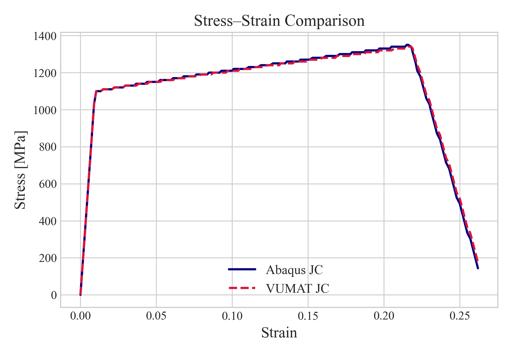
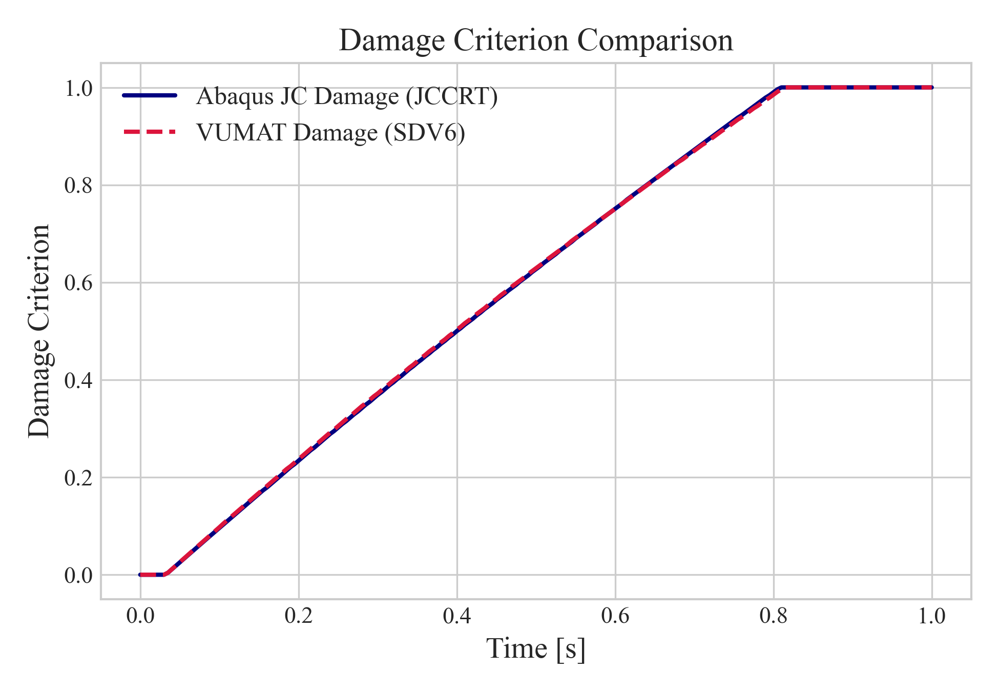

# Johnson–Cook VUMAT with Damage and Taylor–Quinney Heating

This repository contains a user-defined material subroutine (VUMAT) implementing the Johnson–Cook constitutive model for finite deformation plasticity with strain rate and temperature dependence, as well as isotropic damage evolution. The code is developed for use in `Abaqus/Explicit` and written in double precision Fortran.

The implementation is fully documented and based on a return mapping algorithm using the bisection method for stable plastic correction. Damage initiation is based on the Johnson–Cook criterion, while damage evolution follows a displacement-based linear softening law (Displacement at Failure).

## Documentation

A detailed derivation of the governing equations and numerical implementation is provided in the following PDF:

**[johnson-cook-vumat-derivation.pdf](./johnson-cook-vumat-doc.pdf)**

## Validation

The `validation/` folder contains input files and plots for comparing this VUMAT implementation against Abaqus' built-in Johnson–Cook model. The test consists of a single-element cube made of Ti-6Al-4V undergoing uniaxial deformation.

### Input Files

- `jc_ti64_abq_builtin.inp` — Abaqus built-in Johnson–Cook model
- `jc_ti64_vumat.inp` — Custom Johnson–Cook VUMAT

### Comparison Plots

The plots below compare the stress–strain response and damage evolution between the two models. The agreement confirms the accuracy of the implementation.

  

  

### Citations

Material parameters used in the validation test are referenced in `validation/citations.md`.
